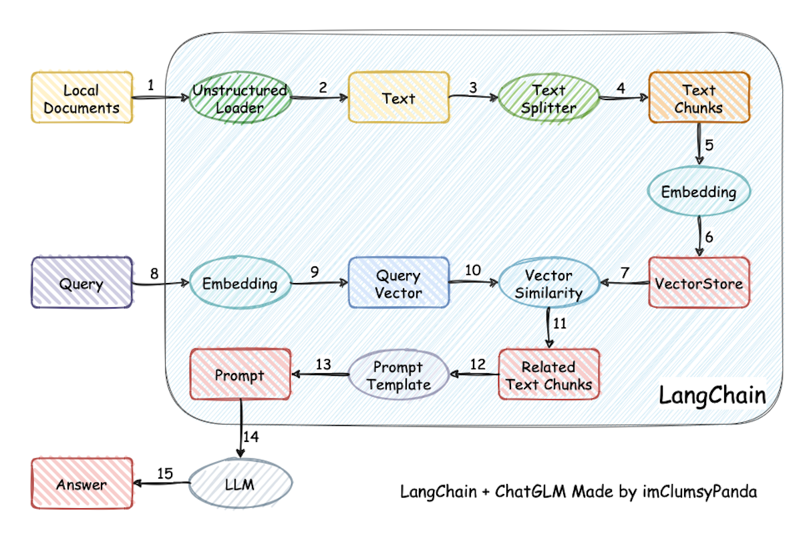

<style>
img[alt~="center"] {
  display: block;
  margin: 0 auto;
}
a[href='red'] {
    color: red;
    pointer-events: none;
    cursor: default;
    text-decoration: none;
}
</style>

<style>
img[alt~="right"] {
  display: block;
  margin:auto;
}
a[href='red'] {
    color: red;
    pointer-events: none;
    cursor: default;
    text-decoration: none;
}
</style>


# **LLM智能应用开发**

第12讲: RAG 技术介绍

<!-- https://marp.app/ -->

---

# 传统的大模型文本生成方式

* 预训练模型生成：直接使用预训练的大语言模型，根据输入的提示生成文本。
  * 依赖模型内部知识：模型基于训练数据中的模式和知识进行生成。

* 存在的缺点:
  * 幻觉问题：模型可能生成不准确或虚构的信息。
  * 上下文长度限制：模型能处理的输入长度有限，无法涵盖大量的背景信息。
  * 知识更新滞后：模型的知识截至训练时间，无法包含最新的信息。

---

# Fine Tune

用专业的知识微调模型，从而赋予其回答专业问题的能力。

然而：

* 成本高昂：微调需要大量的数据和计算资源。
* 不易维护：每次知识更新都需要重新微调模型。
* 过拟合风险：可能导致模型在特定领域过拟合，降低泛化能力。

---

# 引入 RAG 技术

**什么是 RAG?**

* RAG（Retrieval-Augmented Generation）：检索增强生成，是一种结合了检索和生成的模型架构。
* 核心思想：在生成文本时，先从外部知识库中检索相关信息，再结合这些信息进行生成。

---

# RAG 的优势

* 减少幻觉：通过检索真实的资料，降低生成错误信息的概率。
* 突破上下文限制：外部知识库可以包含大量信息，不受模型上下文长度限制。
* 动态更新知识：知识库可以随时更新，模型能够利用最新的信息。

---



---

# 知识库构建

* **数据预处理**：对文档进行清洗、分句等处理。
* **向量化表示**：将文本转换为向量，以便于检索。
* **索引构建**：建立高效的检索索引结构。

存储大量专业领域知识，既便于快速查找，又可以动态更新，只需对新文档进行同样的数据处理即可。

---

# 检索

* **原理**：将问题和文档表示为高维向量，通过计算向量之间的相似度（如余弦相似度）来检索相关文档。
* **流程**：
  1. **向量化表示**：使用预训练模型将文档和问题转换为向量。
  2. **索引构建**：构建高效的向量索引（如 FAISS、Milvus）。
  3. **检索**：通过快速搜索算法找到与问题向量最相似的文档向量。

---

# 生成

* 接收检索到的文档和原始输入，填充 prompt 模板，作为新的输入。
* 将新的 prompt 输入给模型，从而生成基于专业知识的回答。
* 针对生成结果的优化，可能涉及重排（Rerank）、重写（Rewrite）等技术：
  * **重写**：对用户的输入问题进行改写，使其更加清晰及符合上下文；
  * **重排**：对检索出的结果根据相关性进行排序，使最相关的文档排在最前面，提高输入的质量。

---

# 使用 LangChain 实现 RAG

**LangChain**：一个用于构建基于语言模型的应用程序的框架，支持组合 LLM 与其他组件。这个框架由几个部分组成：

* LangChain 库：Python 和 JavaScript 库。包含了各种组件的接口和集成，一个基本的运行时，用于将这些组件组合成链和代理，以及现成的链和代理的实现。
* LangChain 模板：一系列易于部署的参考架构，用于各种任务。
* LangServe：一个用于将 LangChain 链部署为 REST API 的库。
* LangSmith：一个开发者平台，让你可以调试、测试、评估和监控基于任何 LLM 框架构建的链，并且与 LangChain 无缝集成。

---

# 示例代码

导入 LangChain 库

```python
import bs4
from langchain import hub
from langchain_community.document_loaders import WebBaseLoader
from langchain_core.documents import Document
from langchain_text_splitters import RecursiveCharacterTextSplitter
from langgraph.graph import START, StateGraph
from typing_extensions import List, TypedDict
```

---

# 创建 Embedding + LLM 模型实例

```python
from langchain_openai import ChatOpenAI

llm = ChatOpenAI(model="gpt-4o-mini")

from langchain_openai import OpenAIEmbeddings

embeddings = OpenAIEmbeddings(model="text-embedding-3-large")
```

---

# 加载并处理数据

```python
# Load and chunk contents of the blog
loader = WebBaseLoader(
    web_paths=("https://lilianweng.github.io/posts/2023-06-23-agent/",),
    bs_kwargs=dict(
        parse_only=bs4.SoupStrainer(
            class_=("post-content", "post-title", "post-header")
        )
    ),
)
docs = loader.load()

text_splitter = RecursiveCharacterTextSplitter(chunk_size=1000, chunk_overlap=200)
all_splits = text_splitter.split_documents(docs)
```

---

# 建立向量数据库

```python
from langchain_core.vectorstores import InMemoryVectorStore

vector_store = InMemoryVectorStore(embeddings)

# Index chunks
_ = vector_store.add_documents(documents=all_splits)
```

拉取 prompt 模板：

```python
# Define prompt for question-answering
prompt = hub.pull("rlm/rag-prompt")
```

---

# 定义状态类及检索、生成函数

```python
# Define state for application
class State(TypedDict):
    question: str
    context: List[Document]
    answer: str

# Define application steps
def retrieve(state: State):
    retrieved_docs = vector_store.similarity_search(state["question"])
    return {"context": retrieved_docs}

def generate(state: State):
    docs_content = "\n\n".join(doc.page_content for doc in state["context"])
    messages = prompt.invoke({"question": state["question"], "context": docs_content})
    response = llm.invoke(messages)
    return {"answer": response.content}
```

---

# 创建工作流程并测试

```python
# Compile application and test
graph_builder = StateGraph(State).add_sequence([retrieve, generate])
graph_builder.add_edge(START, "retrieve")
graph = graph_builder.compile()

response = graph.invoke({"question": "What is Task Decomposition?"})
print(response["answer"])
```
