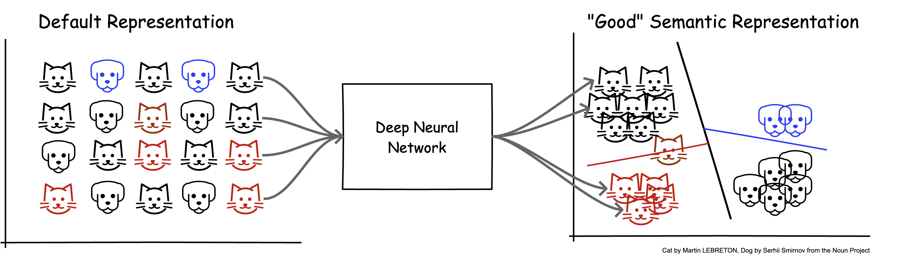
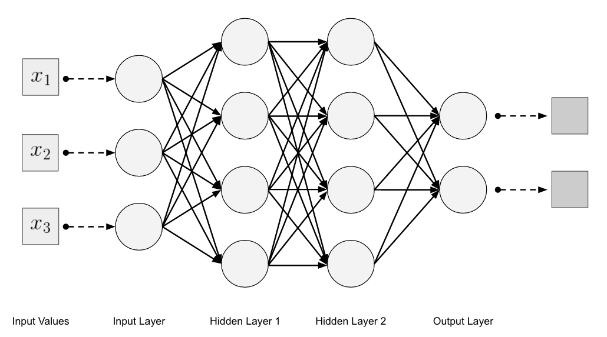
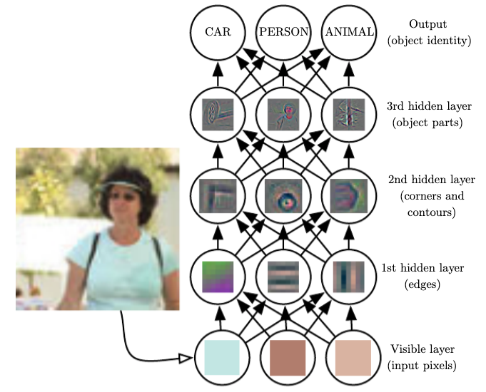
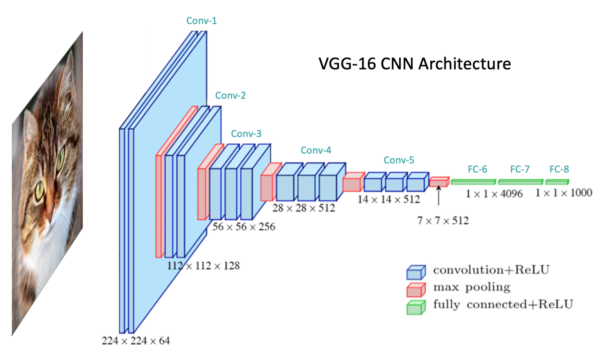
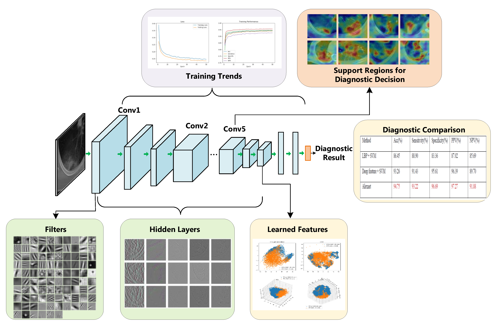

<style>
img[alt~="center"] {
  display: block;
  margin: 0 auto;
}
a[href='red'] {
    color: red;
    pointer-events: none;
    cursor: default;
    text-decoration: none;
}
</style>

<style>
img[alt~="right"] {
  display: block;
  margin:auto;
}
a[href='red'] {
    color: red;
    pointer-events: none;
    cursor: default;
    text-decoration: none;
}
</style>


# **LLM智能应用开发** 

第2讲: 深度学习基础 I

<!-- https://marp.app/ -->

---

# 深度学习的核心(叠甲:之一)

* 理解“世界”

<div style="display:contents;" data-marpit-fragment>
这是何物


</div>

---

# 这是何物第二关


<p align="center">
  
  
</p>

---

# 理解世界的方式

* 如何理解世界: 通过外延观察=>自动构建内涵
  
* 内涵: 一个概念的内涵是指它的“内容”或“定义”，即该概念所包含的性质、特征或条件
  * “人”: 有理性、社会性和自我意识的生物
* 外延: 一个概念的外延是指它所指代的所有对象的集合，或者说它所涵盖的实际事物的范围
  * “人”: 是所有的人类个体，如亚里士多德、牛顿、爱因斯坦

---

# 学习的核心

如何理解世界: 通过外延观察=>自动构建内涵
$y=f(x)=Wx+b$

* 理解世界的过程
  * 设定任务目标
  * 收集外延: 数据集
  * 构建内涵: 学习特征

---

# 深度学习的特点

* 表示学习(representation learning)



---

# 深度学习模型




---

# 深度学习模型



结构
* 前n-1层(堆叠)
  * 输入: 特征表示
  * 输出: 特征表示
* 第n层
  * 输入: 特征表示
  * 输出: 任务目标

---

# 深度学习模型的一层

$y=f(x)=xW^T+b$
* $x$和$y$: 特征表示
  * $x$: 当前层输入/前一层输出
  * $y$: 当前层输出/后一层输入
* $W,b$: 当前层参数
    * 表示空间的变换


---

# PyTorch手搓y=xW^T+b

* 矩阵乘法 (Matrix multiplication)
  * @
  * torch.matmul, tensor.matmul
* 元素乘法 (element-wise multiplication)
  * \*
  * torch.mul, tensor.mul


---

# 编码时间

矩阵乘
```python
y = x@w
y = x.matmul(w)
y = torch.matmul(x, w)
```
元素乘
```python
y = x*w
y = x.mul(w)
y = torch.mul(x, w)
```

---

# 最基础/核心的"积木"

线性层 (torch.nn.Linear): $y=xW^T+b$

* torch.nn.Linear(in_features, out_features, bias=True, device=None, dtype=None)
  * in_features: size of each input sample
  * out_features: size of each output sample

* PyTorch中的输入/输出: 都是tensor
  * input: $(∗,H_{in})$
  * output: $(∗,H_{out})$
  


---

# "积木"nn.Linear的要素


```
self.in_features = in_features
self.out_features = out_features
self.weight = Parameter(torch.empty((out_features, in_features), **factory_kwargs))
```
* weight: W
  * 规约了输入输出的尺寸
  
---

# "积木"nn.Linear的要素

```python
def forward(self, input: Tensor) -> Tensor:
        return F.linear(input, self.weight, self.bias)
```

* 计算方法forward: 定义输入到输出的计算过程
  * nn.Linear的forward: 实现$y=xW^T+b$


---

# nn.Linear的使用

Torch docs中的官方示例
```python
m = nn.Linear(20, 30)
input = torch.randn(128, 20)
output = m(input)
print(output.size())
```

---

# 新手村之积木堆叠

```python
m1 = nn.Linear(20, 30)
m2 = nn.Linear(30, 40)
x = torch.randn(128, 20)
y1 = m1(x)
y2 = m2(y1)
```
* 基于nn.Linear实现以下函数组合
  * $y_1 = xW_1^T+b$且$y_2 = y_1W_2^T+b$
  
---

# 这样的输入行么？

```python
x = torch.randn(128, 4096, 30, 20)
y = m1(x)
y = m2(y)
```
---

# 多种多样的积木

* 线性层(Linear layer), 卷积层(Convolutional layer), 池化层(Pooling layer), 各类正则化(XNorm layer)
* 自定义layer
  * Attention layer, Decoder Layer, ...

---

# 深度学习中的卷积

传统卷积：信号系统中考虑之前时刻的信号经过一些过程后对现在时刻系统输出的影响。
互相关 (cross-correlation)：深度学习领域的“卷积”，考虑两个函数之间基于空间位置的相关性


---

## 深度学习卷积计算

互相关函数$S$, $K$: Kernel, $I$: Input
$S(i,j)=(K*I)(i,j)=\sum_m\sum_nI(i+m,j+n)K(m,n)$

<p align="center">
  
  
</p>

曾经的面试问题: 卷积计算输出的数值越大，表示什么含义？

---

## 卷积示例


---

# 卷积层实现

$\text{out}(N_i,C_{out_j})=\text{bias}(C_{out_j})+\sum_{k=0}^{C_{in}-1}\text{weight}(C_{out_j},k)⋆\text{input}(N_i,k)$
$⋆$: 2D cross-correlation operator
* torch.nn.Conv2d(in_channels, out_channels, kernel_size, stride=1, padding=0, dilation=1, groups=1, bias=True, padding_mode='zeros', device=None, dtype=None)
  * input shape: $(N, C_{in}, H_{in}, W_{in})$
  * output shape: $(N, C_{out}, H_{out}, W_{out})$

* 编码时刻

---

# 模型训练三要素

* 模型结构(包括模型参数)
  * 编码，构建模型
    * 静态: 模型结构定义 (init function)
    * 动态: 模型推理过程实现 (forward function)
* 数据集
  * Dataset和DataLoader
* 优化器/训练算法
  * Loss function，以及优化目标

---

# 从积木拼接到构建模型

无比经典的LeNet系列


Channel: 通道/过滤器（卷积核）

---

# 从积木拼接到构建模型



---

# 从积木拼接到构建模型



---

# 数据集

* dataset
  * 组织数据集
  * 数据集关键要素
    * 路径(path), 大小(size), 如何读取单个样本
* dataloader
  * 规定数据集的读取方式


---

# 优化过程

* 优化器
  * 优化目标: Loss function
  * 优化算法: 梯度下降(GD)
    * 随机梯度下降(SGD), ADAM
* 算法
  * train部分
  * test部分


---

# Talk is cheap. Show me the code.

使用MNIST/CIFAR-10/fashionMNIST数据集，训练图像分类模型
