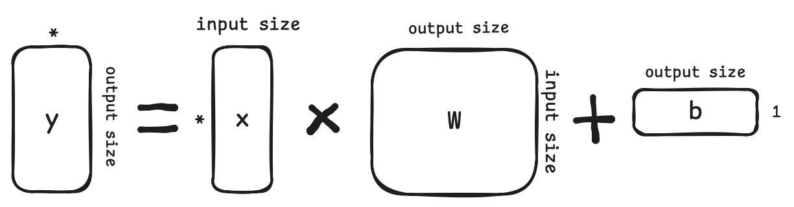
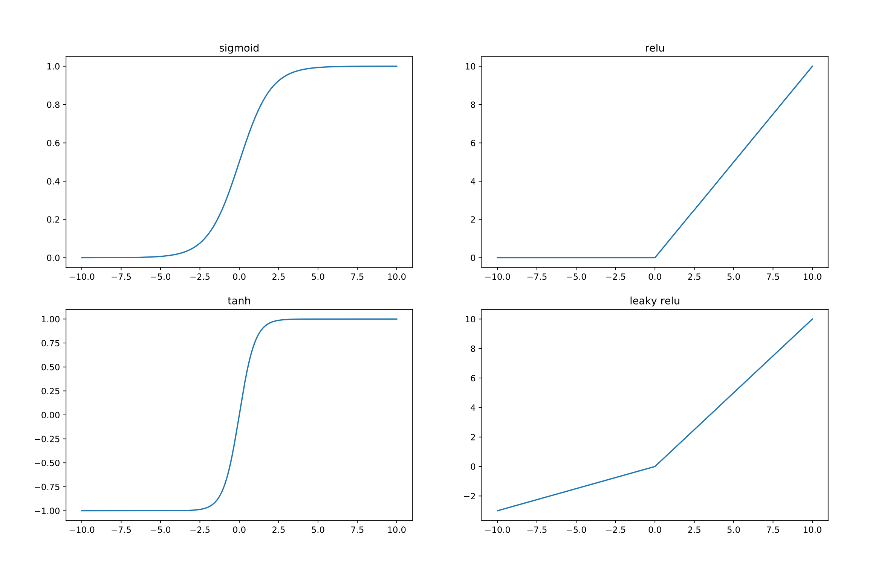
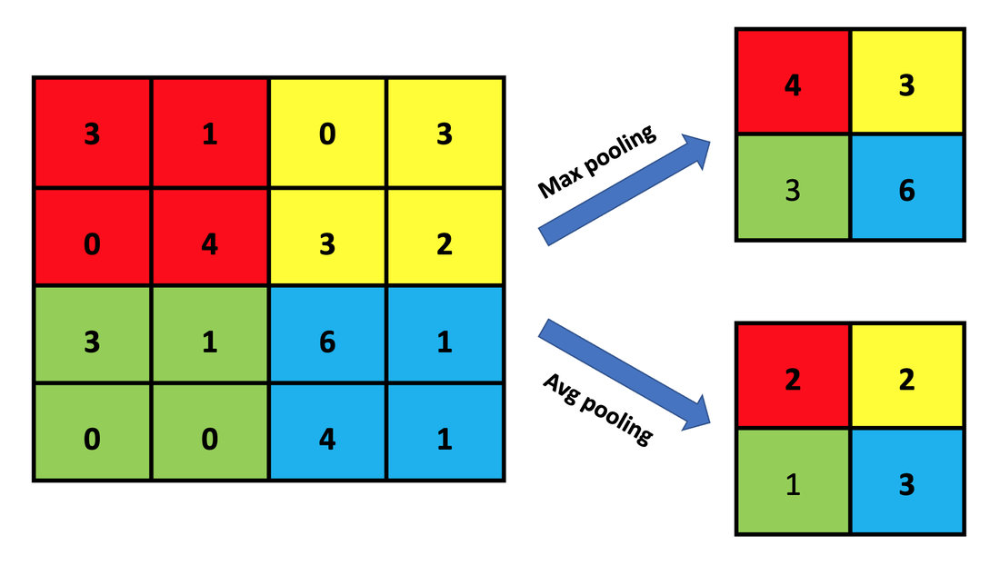
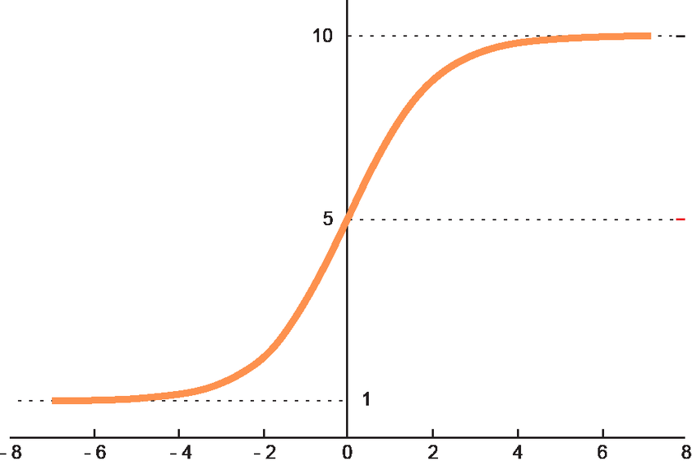
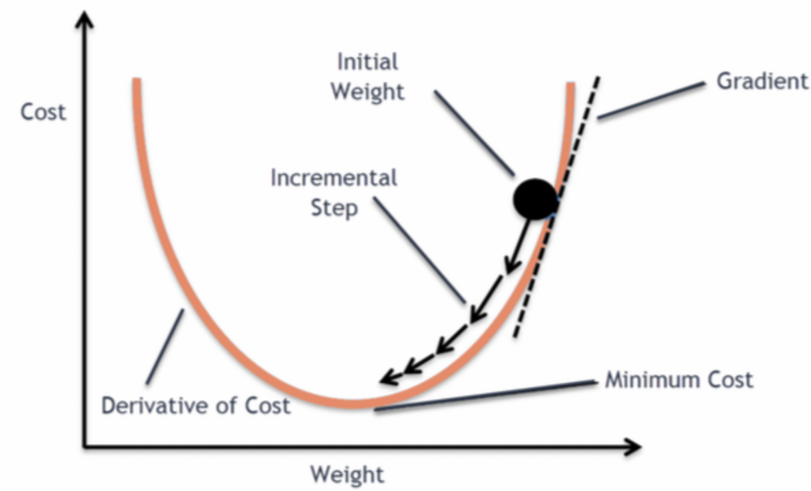

<style>
img[alt~="center"] {
  display: block;
  margin: 0 auto;
}
a[href='red'] {
    color: red;
    pointer-events: none;
    cursor: default;
    text-decoration: none;
}
</style>

<style>
img[alt~="right"] {
  display: block;
  margin:auto;
}
a[href='red'] {
    color: red;
    pointer-events: none;
    cursor: default;
    text-decoration: none;
}
</style>


# **LLM智能应用开发**

第3讲: 深度学习基础 II

<!-- https://marp.app/ -->

---

# 话接上回

* 深度学习模型三要素
  * 静: 模型结构、模型参数
  * 动: 模型训练过程 (优化目标, 优化算法, ...)
  * 学习素材: 数据(集)

* *“搞模型如同炒菜，食材、大厨、锅，缺一不可”*

---

# 模型结构

* 模型结构二要素: 结构定义, forward方法
  * 结构定义:

<div style="display:contents;" data-marpit-fragment>

```python
class LeNet(nn.Module):
    def __init__(self):
        super().__init__()
        self.conv1 = nn.Conv2d(1, 6, 5)
        self.conv2 = nn.Conv2d(6, 16, 5)
        self.fc1 = nn.Linear(16*4*4, 120)
        self.fc2 = nn.Linear(120, 84)
        self.fc3 = nn.Linear(84, 10)

```
</div>


---

# 模型结构

forward方法


```python
def forward(self, x):
        x = nn.functional.relu(self.conv1(x))
        x = nn.functional.max_pool2d(x, 2, 2)
        x = nn.functional.relu(self.conv2(x))
        x = nn.functional.max_pool2d(x, 2, 2)
        x = x.view(-1, 16*4*4)
        x = nn.functional.relu(self.fc1(x))
        x = nn.functional.relu(self.fc2(x))
        x = self.fc3(x)
        return x
```


---

# 模型参数

* 模型参数=$\sum$模型每层的参数

<div style="display:contents;" data-marpit-fragment>

闪回模型的层 $y=f(x)=xW^\top+b$

```python
nn.Linear(input, output)
```
</div>

* nn.Linear
  * 参数: weight, bias
  * 尺寸(shape): weight: (output, input), bias: (output)


---

# 举个例子

$y=f(x)=xW^\top+b$


 

```python
linear = nn.Linear(5,3）
print(linear.weight.shape, linear.bias.shape)
 ```

---

# 举个例子

* torch.matmal, @
* torch.add, + 

* 移步vscode，试一试，shape那些事，以及Tensor Broadcasting


---

# Tensor Broadcasting

试试这段代码

```python
a = torch.randn(2, 2, 4)
print(a)
b = 20
a = a + b
print(a)

c = torch.randn(2,4)
a = a + c
print(c)
print(a)

```

---

# Tensor Broadcasting

并行运算在深度学习时代非常重要

* N个样本，每个样本的shape (2, 4), 模型参数(2, 4)
  * 一个batch的输入通常的shape (2, 2, 4)
  * 如何为这个batch批量执行每个样本和模型参数的计算?
    * 比如: 
      * Tensor 1 (2, 2, 4) * Tensor 2 (2, 4)
      * Tensor 1 (2, 2, 4) @ Tensor 2 (4, 2)


---

# Tensor Broadcasting的原则

* Each tensor must have at least one dimension - no empty tensors.
* Comparing the dimension sizes of the two tensors, going from last to first:
  * Each dimension must be equal, or
  * One of the dimensions must be of size 1, or
  * The dimension does not exist in one of the tensors

来源: [Introduction to PyTorch Tensors](https://pytorch.org/tutorials/beginner/introyt/tensors_deeper_tutorial.html)

---

# 模型结构中一些重要的函数

* nn.functional

* 激活函数(引入非线性)
  * relu, sigmoid
* 池化
  * average pooling, max pooling
    * 1d, 2d, ...

---

# 激活函数(引入非线性)


* 通过引入非线性函数(nonlinear function)可增加模型非线性的能力，在模型中中，也称之为激活函数
  * 线性层: $x=f(x)=xW^\top+b$
  * 激活:   $x=activation(x)$
* activation类型
  * ReLU, Sigmoid, SwiGLU, ...

---

# 激活函数(引入非线性)




---

# 激活函数(引入非线性)


---

# 池化 (pooling)

池化: “粗暴的”降维方法


---

# 池化 (pooling)

池化: “粗暴的”降维方法



---

## 模型的最终输出
以分类问题举例
* 对于多分类问题而言，假设$\textbf{z}$是模型最终的原始输出，是非归一化(unnormalized)的表示,则用softmax函数赋予所有$z_i$概率含义
  * $\text{softmax}(\textbf{z})_i=\frac{\exp(z_i)}{\sum_j\exp(z_j)}$
  * 其中，$\exp(x)=e^x$

---

# softmax示例及可视化

<p align="center">
  

  
</p>


---

# 回顾模型结构: Forward干了些什么事

* 构建模型的推理(inference)过程：计算图

<div style="display:contents;" data-marpit-fragment>

```python
def forward(self, x):
        x = nn.functional.relu(self.conv1(x))
        x = nn.functional.max_pool2d(x, 2, 2)
        x = nn.functional.relu(self.conv2(x))
        x = nn.functional.max_pool2d(x, 2, 2)
        x = x.view(-1, 16*4*4)
        x = nn.functional.relu(self.fc1(x))
        x = nn.functional.relu(self.fc2(x))
        x = self.fc3(x)
        return x
```

</div>

<!-- ---


# PyTorch的动态计算图 -->


---

# 计算图示例

```python
x = torch.ones(5)  # input tensor
y = torch.zeros(3)  # expected output
w = torch.randn(5, 3, requires_grad=True)
b = torch.randn(3, requires_grad=True)
z = torch.matmul(x, w)+b
loss = torch.nn.functional.binary_cross_entropy_with_logits(z, y)
```

<div style="display:contents;" data-marpit-fragment>


</div>

---


# 计算图示例: torchviz展示


---


## 模型的训练/学习
<!--  -->

* 假设，构建模型$f$，其参数为$\theta$
* 目标: 设计一种可用来度量基于$\theta$的模型预测结果和真实结果差距的度量，差距越小，模型越接近需估计的函数$f^*$
  * $J(\theta)=\frac{1}{n}\sum_{x\in \mathcal{X}}(f^*(x)-f(x;\theta))^2$
* 学习方法：梯度下降，寻找合适的$\theta$ (被称之**训练模型**)
<div style="display:contents;" data-marpit-fragment>


</div>


---

# 模型的训练/学习 

* 目标: $J(\theta)=\frac{1}{n}\sum_{x\in \mathcal{X}}(y-f(x;\theta))^2$

<div style="display:contents;" data-marpit-fragment>

1. 猜个$\theta$, 根据输入$x$，计算$\hat{y}=f(x;\theta)$
2. 评估误差: $y$和$\hat{y}$的误差(loss)
3. 根据误差，更新$\theta$: $\theta=\theta -\lambda\cdot\Delta\theta$


</div>

---


---

# 训练模型(参数)

优化目标: $J(\theta)=\frac{1}{n}\sum_{x\in \mathcal{X}}(f^*(x)-f(x;\theta))^2$

梯度下降法 (Gradient descent): 求偏导
* $f^*(x)$通常以真值(groundtruth)体现，因此$\frac{\partial}{\partial \theta}J(\theta)$重点关注$f(x;\theta)$
  * $f(x)=xW^\top+b$ --> $\frac{\partial}{\partial \theta}f(x)=\frac{\partial}{\partial \theta}(xW^\top+b)$ 
  * 通常深度学习模型$f(x)$为复合函数，需利用链式法则求偏导

* 核心算法: 反向传播(backpropagation)
  * 核心步骤: 针对优化目标$J(\theta)$求其偏导数(partial derivative)


---

# 反向传播(backpropagation)

* 假设深度学习模型为$f(x)=xW^\top+b$的复合函数
  * $y=f_3(f_2(f_1(x)))$
* 优化目标$J(\theta)$的偏导$\frac{\partial}{\partial \theta}J$的核心为$\frac{\partial}{\partial \theta}y=\frac{\partial}{\partial \theta}f_3(f_2(f_1(x)))$
* 链式法则展开:
  * $\frac{\partial J}{\partial \theta_{f_1}} = \frac{\partial J}{\partial y}\cdot \frac{\partial y}{\partial f_3}\cdot \frac{\partial f_3}{\partial f_2}\cdot \frac{\partial f_2}{\partial f_1} \cdot \frac{\partial f_1}{\partial \theta_{f_1}}$

* 偏导的构建
  * 传统手工实现 v.s. autograd


---


# Autograd

* “古代”手工实现
  * forward: 代码实现$f(x)$
  * backward: 手推偏导公式$\frac{\partial}{\partial \theta}f(x)$，照着公式进行代码实现

* autograd
  * forward: 基于forward实现构建计算图
  * backward: 基于计算图实现自动微分(automatic differentiation)

---

# Autograd深入理解

参考阅读

1. [Overview of PyTorch Autograd Engine](https://pytorch.org/blog/overview-of-pytorch-autograd-engine/)

2. [How Computational Graphs are Constructed in PyTorch](https://pytorch.org/blog/computational-graphs-constructed-in-pytorch/)

3. [How Computational Graphs are Executed in PyTorch](https://pytorch.org/blog/how-computational-graphs-are-executed-in-pytorch/)


---

# 模型的训练/学习 

目标: $J(\theta)=\frac{1}{n}\sum_{x\in \mathcal{X}}(y-f(x;\theta))^2$


1. 猜个$\theta$, 根据输入$x$，计算$\hat{y}=f(x;\theta)$ -> **模型forward过程**
2. 评估误差: $y$和$\hat{y}$的误差(loss)  -> **选择loss function，并计算**
3. 根据误差，更新$\theta$: $\theta=\theta -\lambda\cdot\Delta\theta$ -> **优化器更新模型参数**


---

# 模型的训练/学习的实现

定义损失函数(loss)，以及优化器(优化算法)
```python
ce_loss = nn.CrossEntropyLoss()
optimizer = torch.optim.SGD(model.parameters(), lr=1e-3)
```

* 常见损失函数，可在torch.nn中调用
  * nn.CrossEntropyLoss, nn.L1Loss, nn.MSELoss, nn.NLLLoss, nn.KLDivLoss, nn.BCELoss, ...

* 常见优化算法，可在torch.optim中调用
  * optim.SGD, optim.Adam, optim.AdamW, optim.LBFGS, ...


---

# 训练流程


```python
def train(dataloader, model, loss_fn, optimizer):
    size = len(dataloader.dataset)
    model.train()
    for batch, (X, y) in enumerate(dataloader):
        pred = model(X)
        l = loss_fn(pred, y)
        optimizer.zero_grad()
        l.backward()
        optimizer.step()
        if batch % 100 == 0:
            loss, current = l.item(), batch * len(X)
            print(f"loss: {loss:>7f}  [{current:>5d}/{size:>5d}]")
            
```

---

# 测试流程

```python

def test(dataloader, model, loss_fn):
    size = len(dataloader.dataset)
    num_batches = len(dataloader)
    model.eval()
    test_loss, correct = 0, 0
    with torch.no_grad():
        for X, y in dataloader:
            pred = model(X)
            test_loss += loss_fn(pred, y).item()
            correct += (pred.argmax(1) == y).type(torch.float).sum().item()
    test_loss /= num_batches
    correct /= size
    print(f"Test Error: \n Accuracy: {(100*correct):>0.1f}%, Avg loss: {test_loss:>8f} \n")
    return correct

```