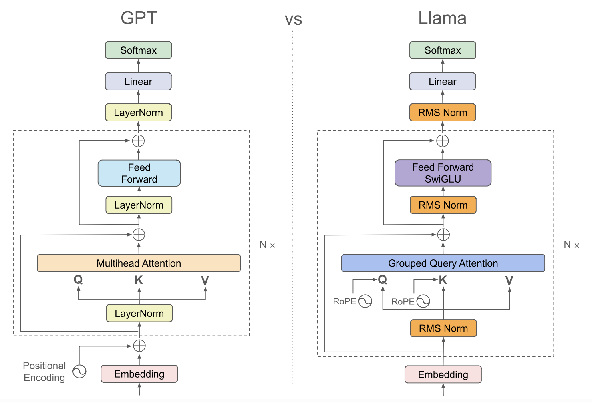
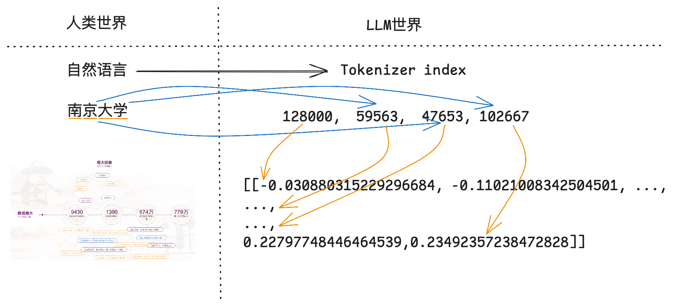
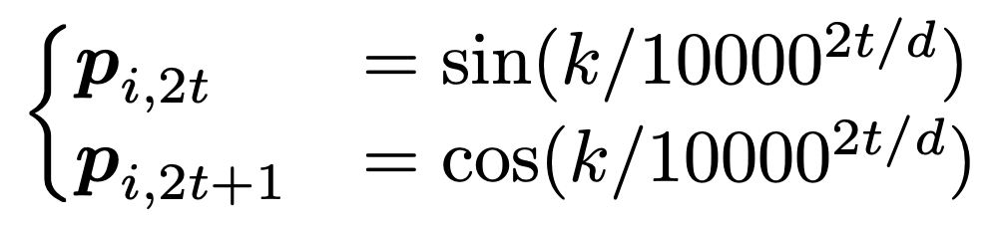

<style>
img[alt~="center"] {
  display: block;
  margin: 0 auto;
}
a[href='red'] {
    color: red;
    pointer-events: none;
    cursor: default;
    text-decoration: none;
}
</style>

<style>
img[alt~="right"] {
  display: block;
  margin:auto;
}
a[href='red'] {
    color: red;
    pointer-events: none;
    cursor: default;
    text-decoration: none;
}
</style>


# **LLM智能应用开发**

第4讲: 大语言模型解析 I

基于HF LlaMA实现的讲解

<!-- https://marp.app/ -->

---

# LLM结构的学习路径

* LLM结构解析(开源LlaMA)
* 自定义数据集构造
* 自定义损失函数和模型训练/微调

---

# Transformer经典结构


* Encoder-decoder结构
* 输入部分
  * Input embedding
  * Positional embedding
* Transformer部分
  * Attention
  * Feed forward


---

# LlaMA的模型结构




---

# HF LlaMA模型结构

```python
LlamaForCausalLM(
  (model): LlamaModel(
    (embed_tokens): Embedding(128256, 2048)
    (layers): ModuleList(
      (0-15): 16 x LlamaDecoderLayer(
        (self_attn): LlamaAttention
        (mlp): LlamaMLP
        (input_layernorm): LlamaRMSNorm
        (post_attention_layernorm): LlamaRMSNorm
    )
    (norm): LlamaRMSNorm((2048,), eps=1e-05)
    (rotary_emb): LlamaRotaryEmbedding()
  )
  (lm_head): Linear(in_features=2048, out_features=128256, bias=False)
)
```


---

# LlamaDecoderLayer内部结构

```python
(self_attn): LlamaAttention(
  (q_proj): Linear(in_features=2048, out_features=2048, bias=False)
  (k_proj): Linear(in_features=2048, out_features=512, bias=False)
  (v_proj): Linear(in_features=2048, out_features=512, bias=False)
  (o_proj): Linear(in_features=2048, out_features=2048, bias=False)
  (rotary_emb): LlamaRotaryEmbedding()
)
(mlp): LlamaMLP(
  (gate_proj): Linear(in_features=2048, out_features=8192, bias=False)
  (up_proj): Linear(in_features=2048, out_features=8192, bias=False)
  (down_proj): Linear(in_features=8192, out_features=2048, bias=False)
  (act_fn): SiLU()
)
(input_layernorm): LlamaRMSNorm((2048,), eps=1e-05)
(post_attention_layernorm): LlamaRMSNorm((2048,), eps=1e-05)
```

---

# 本次课程关注


- 目前，流行结构多为Decoder-only
- **输入部分**
  - **Input embedding**
  - **Positional embedding**
- Transformer部分
  - Attention
  - Feed forward 


---

# Input embedding

```python
(embed_tokens): Embedding(128256, 2048)
```

* embedding：将自然语言翻译为index
* 每个index对应一个embedding
  * embedding需训练
* 例如：
  * 用户给LLM的输入: "你好，请介绍下南京大学"
  * LLM经过预训练的embedding: [[0.2234234,-0.28178,...]]

<div style="display:contents;" data-marpit-fragment>
翻译过程：一般由tokenizer实现
</div>

---

# Input embedding原理


"语言是文明的载体，对人类而言是这样，对LLM而言也是这样"


<div style="display:contents;" data-marpit-fragment>


这是南京大学


</div>

---

# Input embedding原理

这也是南京大学


---

# Input embedding原理

<!-- <p align="center">
  

  
</p> -->

这是属于南大的(部分)特征

<p align="center">
  
</p>

---

# Input embedding原理

**Input embedding**：构建表达自然语言**特征**的**表示 (representation)**

<p align="center">
  
</p>

---

# 为LLM构建词汇表

* 自然语言是离散的，LLM词汇表依然延续离散的模式构建
* 如何分词: 'Hello, world!'
  * word-based: | hello | , | world | ! |
  * character-based: h|e|l|l|o|,|w|o|r|l|d|!
  * subword-based tokenization
    * 基本原则：常用词不拆分，稀有词分解为有意义的子词(subword)
    * 来试试[Tiktokenizer](https://tiktokenizer.vercel.app/?model=meta-llama%2FMeta-Llama-3-8B)

---

# Tokenization方式

* Byte-level BPE (GPT2)
* WordPiece (BERT)
* SentencePiece (Multilingual models)

* Tokenizer in LlaMA3
  * BPE model based on [tiktoken](https://github.com/openai/tiktoken)


---

# 来试试LlaMA3的Tokenizer

一般每个LLM会自带tokenizer，用以下方式加载模型对应的tokenizer
```python
from transformers import AutoTokenizer
tokenizer = AutoTokenizer.from_pretrained(model_id)
```

* 使用方法
  * tokenizer(input)
  * tokenizer.tokenize(input)
  * tokenizer.encode(input)
  * tokenizer.decode(input)


---

# 位置编码 (Positional embeddings)


**位置编码：用来标记每个词的位置**

* Sinusoidal PE
  * Attention is all you need时代的位置编码
* Rotary PE(旋转位置编码)
  * 基于论文[RoFormer](https://arxiv.org/abs/2104.09864)

---

# 位置编码的初衷

* Attention模块计算的是每个token的注意力分数
  * 衡量token与token之间的相关性
* 位置编码用来标记每个token的位置
  * 让LLM更好的建模不同位置的token之间的关系

---

# 绝对位置编码

直接在每个token的embedding上线性叠加位置编码: $x_i + p_i$，其中$p_i$为可训练的向量

<div style="display:contents;" data-marpit-fragment>

Sinusoidal PE: Attention is all you need



</div>

<div style="display:contents;" data-marpit-fragment>

灵感来源：通过周期性建模位置编码

</div>

---

# 位置编码与序数编码的关联

* 序数表示次序，位置编码的用意也在于此。例如从小就学的序数编码：
  * 十进制: 1 2 3 4 5 6 7 8 9 10, ...
  * 二进制: 0, 1, 10, 11, 100, 101, 110, 111, 1000, 1001, ...
* **但是**：
  * LLM中的token embedding为向量,如何构造型为向量的位置编码？

---

# 序数的周期性

十进制本身是周期性的，二进制也是周期性的


---


# Sinusodial PE

构建n维的位置编码，每一维用不同的周期函数刻画取值


---

# 旋转位置编码（Rotary PE）


<div style="display:contents;" data-marpit-fragment>

“叠加旋转位置编码的方式由加法改乘法”

</div>

<div style="display:contents;" data-marpit-fragment>

假设两个token的embedding为$x_m$和$x_n$，$m$和$n$分别代表两个token的位置，目标找到一个等价的位置编码方式，使得下述等式成立：


</div>

<div style="display:contents;" data-marpit-fragment>

[RoFormer](https://arxiv.org/abs/2104.09864)提出Rotary PE，在embedding维度为2的情况下：


</div>

---

# Rotary PE的2D理解

回忆下欧拉公式：$e^{ix}=cos(x)+isin(x)$

<div style="display:contents;" data-marpit-fragment>


</div>

<div style="display:contents;" data-marpit-fragment>

因此，上述函数$f$和$g$中的指数函数$e^{ix}$具体表示为 

</div>


---

# RoPE实现

RoPE的2D实现


RoPE的n维实现


---


# Rotary PE的可视化展示


---

# RoPE在LlaMA中的构建

不同于经典Transformers结构，只对输入的token做位置编码的叠加

LlaMA中的RoPE在Transformer的每一层都会对Q和K进行位置编码的叠加


---

# 拓展阅读&参考文档

[Hugging Face](https://huggingface.co/transformers/model_doc/llama.html)
[Accelerating a Hugging Face Llama 2 and Llama 3 models with Transformer Engine](https://docs.nvidia.com/deeplearning/transformer-engine/user-guide/examples/te_llama/tutorial_accelerate_hf_llama_with_te.html)

RoPE部分
[Transformer升级之路：10、RoPE是一种β进制编码. 苏剑林](https://kexue.fm/archives/9675)
[RoFormer: Enhanced Transformer with Rotary Position Embedding](https://arxiv.org/pdf/2104.09864)