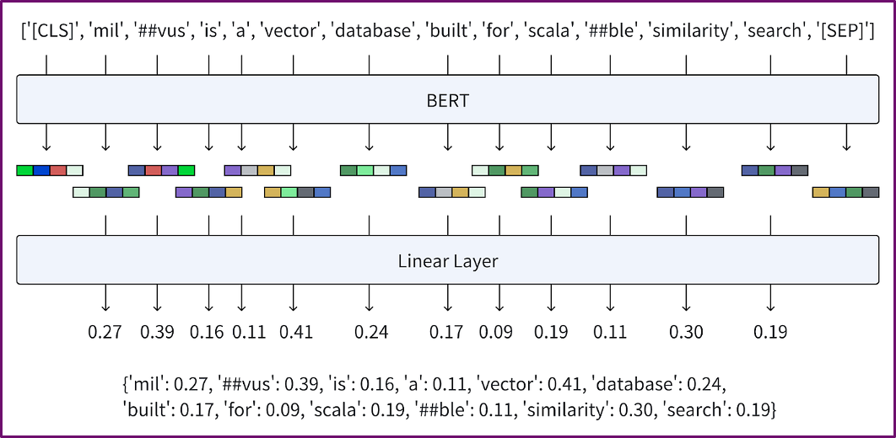
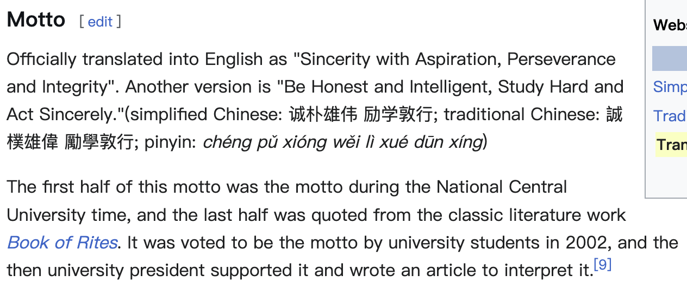
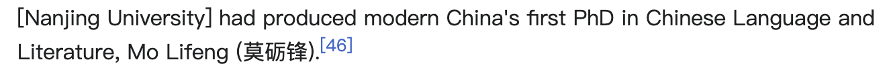
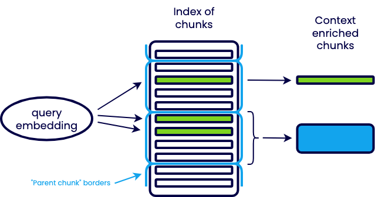

# 代码
代码在./code/下

# 使用Haystack实现RAG
[**Haystack**](https://haystack.deepset.ai/)：一个用于构建基于语言模型的应用程序的框架，有四大部分：
- Document：Haystack的核心数据类型
- component：一个组件单元，用于实现一个功能，例如：清理文件、切分文档、生成嵌入、初步检索、重排序等等
- pipeline：一条流水线，将组件串联起来，自动依次调用组件
- document store：存储文档的向量数据库

``` bash
pip install haystack-ai 
```

## Document
向量数据库的基本存储单元
```python
@dataclass
class Document(metaclass=_BackwardCompatible):
	# 文档的ID
	id: str = field(default="")
	
	# 文档的内容
	content: Optional[str] = field(default=None)
	
	# 检索和重排序时文档的分数
	score: Optional[float] = field(default=None)
	
	# 文档的密集嵌入，一个向量
	embedding: Optional[List[float]] = field(default=None)
	
	# 文档的稀疏嵌入，一个index-value的稀疏向量
	sparse_embedding: Optional[SparseEmbedding] = field(default=None) 
	
	# 文档存在表格时，其pandas dataframe
	dataframe: Optional[DataFrame] = field(default=None) 
	# 文档的二进制数据
	blob: Optional[ByteStream] = field(default=None)
	# 文档的元数据，例如文档名，文档作者，文档时间等
	meta: Dict[str, Any] = field(default_factory=dict)

@dataclass
class SparseEmbedding:
	indices: List[int]
	values: List[float]
```

## component
需要标明该组件单元的**输入**、**输出**和**处理代码**
```python
from haystack import Document, component
@component
class DocumentCleaner:
	@component.output_types(documents=List[Document]) # 输出在注解处标明
	def run(self, documents: List[Document]): # 输入在方法参数处标明
		# 处理代码在run()方法里
		cleaned_docs = clean(documents) # 清理文档内容...
		return {"documents": cleaned_docs} # 返回值必须是一个字典，key是和输出注解同名的字符串，value是清理好的文档列表
```

## Pipeline
- 将定义好的组件单元(component)添加到流水线中
- 将组件单元连接起来，一般情况下都是有向无环图
- 组件单元的输入即可以来自内部的前一个组件的输出，也可以来自外部传入的数据
```python
class Pipeline:
	# 启动流水线
	def run(
		self, 
		data: Dict[str, Any], # 外部传入的数据，通过字典指定要给哪个组件传入哪个输入
	) -> Dict[str, Any]: # 流水线的最终输出，通过字典说明哪个组件的哪个输出
	  
	# 将组件instance加入流水线，并命名为name
	def add_component(self, name: str, instance: Component) -> None:

	# 将两个组件的输入和输出连接起来
	def connect(self, sender: str, receiver: str)
```


# Converter
将一个文件转换成Haystack的核心数据类型：**Document**
```python
from haystack.components.converters import TextFileToDocument

converter = TextFileToDocument()
docs = converter.run(sources=["./files/hello_world.txt"])["documents"]

print(f"id: {docs[0].id}")
print(f"content: {docs[0].content}")
print(f"score: {docs[0].score}")
print(f"embedding: {docs[0].embedding}")
print(f"sparse_embedding: {docs[0].sparse_embedding}")
print(f"meta: {docs[0].meta}")
```
- **TextFileToDocument**：一个component组件，输入是知识库文件路径列表list\[Path\]，输出是一个文档列表list\[Document\]
- 输出结果：（没有嵌入处理和检索，所以没有嵌入和分数）
```bash
id: d172a9449a4ebf5abebefcd66fb6d9292d2de8c4c60973b593819d05dcc54c7d
content: hello, world!
score: None
embedding: None
sparse_embedding: None
meta: {"file_path": "./files/hello_world.txt"}
```

# Splitter
文档切分是RAG的第一个核心点，目前主流有两种方式：直接切分和语法切分
在介绍具体切分方法之前，需要回答：什么样的文档块是好的？
- **文档块长度需要适中**，这个长度不好拿捏
	- 长文档块的缺点：
		1. 输入上下文增大，降低回答质量
		2. 信息量过多，检索准确度降低
		3. 信息量过多，正确的参考信息被太多无关信息淹没，大模型找不到
	- 短文档块的缺点：
		1. 信息量过少，大模型找不到参考信息
		2. 文档数量提升，降低检索速度
		3. 更多的语义碎片，丢失语义连贯性和长文本中的实体依赖关系，俗称“说话说一半”
- **文档块的内容要全面**：但往往全面的文档块会很长，所以更重要的是如何在保证文档块长度适中的情况下，把“说话说一半”提升到“说话说四分之三”
- **文档块的长度要平均**：尽量保证所有文档块的长度都差不多长。因为在计算相似度分数时，嵌入模型会更倾向于给短文档块打更高的分数。
## DocumentSplitter
- **split_by**：常用的基本单位有page、passage、sentence、line、word，这里我们以词(word)为基本单位进行切分。哪个基本单位好呢？
	- word看起来很好，因为它可以保证所有的文档块都一样长，足够平均；但在头尾处会出现严重的不连贯现象
	- page和passage则是的文档块长度分布不均，以及超长文档块的出现
	- 所以一般而言sentence或line是个不错的选择
- **split_length**：切分的基本长度
- **split_overlap**：为了减少“说话说一半”的情况出现，让文档块之间相互重叠。假如2 3是连贯内容，重叠就可以使得它们连起来；不重叠则会被切断

```python
from haystack.components.preprocessors import DocumentSplitter
from haystack import Document

numbers = "0 1 2 3 4 5 6 7 8 9"
document = Document(content=numbers)
splitter = DocumentSplitter(split_by="word", split_length=3, split_overlap=1)
docs = splitter.run(documents=[document])["documents"]

print(f"document: {document.content}")
for index,doc in enumerate(docs):
	print(f"document_{index}: {doc.content}")
```

```bash
document:   0 1 2 3 4 5 6 7 8 9
document_0: 0 1 2 
document_1: 2 3 4 
document_2: 4 5 6 
document_3: 6 7 8 
document_4: 8 9
```

## NLTKDocumentSplitter
### 奇怪的输入
```python
from haystack.components.preprocessors import NLTKDocumentSplitter, DocumentSplitter
from haystack import Document

text = """The dog was called Wellington. It belonged to Mrs. Shears who was our friend. She lived on the opposite side of the road, two houses to the left."""
document = Document(content=text)
```
### 简单以句子为单位切分
```python
simple_splitter = DocumentSplitter(split_by="sentence", split_length=1, split_overlap=0)
simple_docs = simple_splitter.run(documents=[document])["documents"]
print("\nsimple:")
for index, doc in enumerate(simple_docs):
    print(f"document_{index}: {doc.content}")
```
### 输出
```
simple:
document_0: The dog was called Wellington.
document_1:  It belonged to Mrs.
document_2:  Shears who was our friend.
document_3:  She lived on the opposite side of the road, two houses to the left.
```
>无法区分 Mrs. Shears的点号和句号，所以我们需要nltk来对单词和符号进行tag标注
### NLTK
```python
nltk_splitter = NLTKDocumentSplitter(split_by="sentence", split_length=1, split_overlap=0)
nltk_docs = nltk_splitter.run(documents=[document])["documents"]
print("\nnltk:")
for index, doc in enumerate(nltk_docs):
    print(f"document_{index}: {doc.content}")
```
### 输出
```
nltk:
document_0: The dog was called Wellington. 
document_1: It belonged to Mrs. Shears who was our friend. 
document_2: She lived on the opposite side of the road, two houses to the left.
```


# Retriever
## BM25Retriever
### 原理
- BM25是搜索引擎领域计算查询与文档相关性的排名函数
- 它是一种**基于词袋的检索函数**：通过统计查询和文档的单词匹配数量来计算二者相似度分数
- 具体公式如下：
	- 查询$Q$包含关键字$q_1,…,q_n$
	- $f(q_i,D)$是$q_i$在文档$D$中的词频
	- $|D|$是文档长度
	- $avgdl$是平均文档长度 ; $IDF(q_i )$是$q_i$的逆向文档频率权重 ; $k_1$和$b$是自由参数
$$
\text{score}(D, Q) = \sum_{i=1}^{n} \text{IDF}(q_i) \cdot \frac{f(q_i, D) \cdot (k_1 + 1)}{f(q_i, D) + k_1 \cdot \left(1 - b + b \cdot \frac{|D|}{\text{avgdl}}\right)}
$$
### 例子
#### import
```python
from haystack import Document
from haystack.components.retrievers.in_memory import InMemoryBM25Retriever
from haystack.document_stores.in_memory import InMemoryDocumentStore
```
#### 处理文档
```python
document_store = InMemoryDocumentStore()
documents = [
	Document(content="There are over 7,000 languages spoken around the world today."),
	Document(content="Elephants have been observed to behave in a way that indicates a high level of self-awareness, such as recognizing themselves in mirrors."),
	Document(content="In certain parts of the world, like the Maldives, Puerto Rico, and San Diego, you can witness the phenomenon of bioluminescent waves.")
]
document_store.write_documents(documents=documents)
```
#### 处理查询
```python
retriever = InMemoryBM25Retriever(document_store=document_store)
docs = retriever.run(query="How many languages are spoken around the world today?")["documents"]
for doc in docs:
	print(f"content: {doc.content}")
	print(f"score: {doc.score}\n")
```
#### 输出
```
content: There are over 7,000 languages spoken around the world today.
score: 7.815769833242408

content: In certain parts of the world, like the Maldives, Puerto Rico, and San Diego, you can witness the phenomenon of bioluminescent waves.
score: 4.314753296196667

content: Elephants have been observed to behave in a way that indicates a high level of self-awareness, such as recognizing themselves in mirrors.
score: 3.652595952218814
```
### 优缺点
- **速度快**：基于统计的分数计算公式很简单，可以快速处理大规模文本数据
- **存储开销小**：除文本外无需存储额外数据。如果下游大模型通过API调用，rag不需要显卡也能跑起来，而且很快
- **太依赖关键字**：query质量不高就搜不到，无法捕获文本的上下文语义信息。很像在搜索引擎中不输入关键字就搜不到我们想要的内容


## BERT
最近几年，一种基于BERT架构衍生出来的多种语义检索技术被更多地用到了rag中，他是一种encoder-only的transformer架构：
- **Tokenizer**：words -> tokens
- **Embedding**：tokens -> vectors
- **Encoder Stack**：vectors -> vectors
简言之，它可以将文本转换成若干token vector
]
## DenseEmbeddingRetriever
### 文本嵌入模型
密集嵌入检索器基于双编码器(Bi-Encoder)架构，在BERT上面外加一层池化层(Pooling)，得到单一的句向量，存储到document.embedding中。
- sentence ->**BERT-Encoder** -> token vectors
- token vectors -> **Pooling Layer** -> sentence vector
- score(SentenceA, SentenceB) = cosine_similarity(vectorA,vectorB)

### 相似度计算
- 密集向量会交给一个经过训练的嵌入模型生成，它可以将**相似的句子**映射到高维空间中**距离相近、方向相似的向量**
- 常用的相似度分数计算公式有两种：
	- **余弦相似度**：常用的相似度计算公式，计算两个向量之间的夹角的余弦值。两个向量的方向越一致相似度越高
		- $$\text{Cosine Similarity} = \frac{\mathbf{A} \cdot \mathbf{B}}{\|\mathbf{A}\| \|\mathbf{B}\|} = \frac{\sum_{i=1}^n A_i B_i}{\sqrt{\sum_{i=1}^n A_i^2} \cdot \sqrt{\sum_{i=1}^n B_i^2}}$$
	- **欧几里得相似度**：直接计算两个向量之间的欧几里得距离，然后取个倒数得到相似度分数。也可以用其他距离：曼哈顿距离、汉明距离等
		- $$\text{Euclidean Similarity} = \frac{1}{1+\sqrt{\sum_{i=1}^n (A_i - B_i)^2}}$$

### 例子
- **模型**: sentence-transformers/all-MiniLM-L6-v2, 22.7M params
- **相似度分数**：余弦相似度
#### import
```python
from haystack import Document, Pipeline
from haystack.document_stores.in_memory import InMemoryDocumentStore
from haystack.components.embedders import (
    SentenceTransformersTextEmbedder,
    SentenceTransformersDocumentEmbedder,
)
from haystack.components.retrievers import InMemoryEmbeddingRetriever
```
#### 处理文档
```python
document_store = InMemoryDocumentStore(embedding_similarity_function="cosine")

documents = [
    Document(content="There are over 7,000 languages spoken around the world today."),
    Document(content="Elephants have been observed to behave in a way that indicates a high level of self-awareness, such as recognizing themselves in mirrors."),
    Document(content="In certain parts of the world, like the Maldives, Puerto Rico, and San Diego, you can witness the phenomenon of bioluminescent waves."),
]

document_embedder = SentenceTransformersDocumentEmbedder(
    model="sentence-transformers/all-MiniLM-L6-v2"
)
document_embedder.warm_up()
documents_with_embeddings = document_embedder.run(documents)["documents"]
document_store.write_documents(documents_with_embeddings)
for doc in documents_with_embeddings:
    print(f"content: {doc.content}")
    print(f"score: {doc.score}")
    print(f"embedding: {doc.embedding}\n")
```
#### 输出
```
content: There are over 7,000 languages spoken around the world today.
score: None
embedding: [0.03276507928967476, ..., 0.022160163149237633]

content: Elephants have been observed to behave in a way that indicates a high level of self-awareness, such as recognizing themselves in mirrors.
score: None
embedding: [0.01985647901892662, ..., 0.007489172276109457]

content: In certain parts of the world, like the Maldives, Puerto Rico, and San Diego, you can witness the phenomenon of bioluminescent waves.
score: None
embedding: [0.08535218983888626, ..., 0.013049677945673466]
```
#### 处理查询
```python
query_pipeline = Pipeline()
query_pipeline.add_component(
    "text_embedder",
    SentenceTransformersTextEmbedder(model="sentence-transformers/all-MiniLM-L6-v2"),
)
query_pipeline.add_component(
    "retriever", InMemoryEmbeddingRetriever(document_store=document_store)
)
query_pipeline.connect("text_embedder.embedding", "retriever.query_embedding")

query = "How many languages are there?"
result = query_pipeline.run({"text_embedder": {"text": query}})
result_documents = result["retriever"]["documents"]
for doc in result_documents:
    print(f"content: {doc.content}")
    print(f"score: {doc.score}\n")
```
#### 输出
```
content: There are over 7,000 languages spoken around the world today.
score: 0.7557791921810213

content: Elephants have been observed to behave in a way that indicates a high level of self-awareness, such as recognizing themselves in mirrors.
score: 0.04221229572888512

content: In certain parts of the world, like the Maldives, Puerto Rico, and San Diego, you can witness the phenomenon of bioluminescent waves.
score: -0.001667837080811814
```
### 优缺点
- **速度快**：可以提前在GPU上计算并存储文档块的dense embedding，计算相似度就会很快
- **存储开销小**：每个文档块只需要额外存储一个高纬向量(通常768或1024纬)
- **捕获句子的语义信息**：只要是相似的句子，关键字不匹配也可以检索到
- **丢失词元信息**：BERT产生的众多词元向量全部被映射到单一句向量，丢失了很多文本中的细节。快速地粗读文本，速度虽快但忽略了细节，只了解了个大概


## SparseEmbeddingRetriever
### 文本嵌入模型
稀疏嵌入检索器基于双编码器(Bi-Encoder)架构，在BERT上面外加一层线性层，得到稀疏向量(向量中有大量零值)，存储到document.sparse_embedding
- 稀疏向量也会交给一个经过训练的嵌入模型生成，它实际上是一个纬度非常高的dense_embedding，但只保留值较高的纬度，剩余的它认为不重要的纬度全部清零
- 相似度分数的计算和密集向量一样


### 例子
- **模型**: prithivida/Splade_PP_en_v1
- **相似度分数**：余弦相似度
#### import
```python
from haystack import Document, Pipeline
from haystack_integrations.components.retrievers.qdrant import (
    QdrantSparseEmbeddingRetriever,
)
from haystack_integrations.document_stores.qdrant import QdrantDocumentStore
from haystack_integrations.components.embedders.fastembed import (
    FastembedSparseDocumentEmbedder,
    FastembedSparseTextEmbedder,
)
```
#### 处理文档
```python
document_store = QdrantDocumentStore(
    ":memory:", recreate_index=True, use_sparse_embeddings=True, similarity="cosine"
)

documents = [
    Document(content="My name is Wolfgang and I live in Berlin"),
    Document(content="I saw a black horse running"),
    Document(content="Germany has many big cities"),
    Document(content="fastembed is supported by and maintained by Qdrant."),
]
  

sparse_document_embedder = FastembedSparseDocumentEmbedder(model="prithivida/Splade_PP_en_v1")
sparse_document_embedder.warm_up()
documents_with_embeddings = sparse_document_embedder.run(documents)["documents"]
document_store.write_documents(documents_with_embeddings)
for doc in documents_with_embeddings:
    print(f"content: {doc.content}")
    print(f"score: {doc.score}")
    print(f"sparse_embedding: {doc.sparse_embedding}\n")
```
#### 输出
```
content: My name is Wolfgang and I live in Berlin
score: None
sparse_embedding: SparseEmbedding(indices=[1006, ..., 13960], values=[0.5768579244613647, ..., 0.3235206604003906])

content: I saw a black horse running
score: None
sparse_embedding: SparseEmbedding(indices=[1045, ..., 10823], values=[0.2623414993286133, ..., 0.6651656031608582])

content: Germany has many big cities
score: None
sparse_embedding: SparseEmbedding(indices=[2031, ..., 10505], values=[0.8983744382858276, ..., 0.5143937468528748])

content: fastembed is supported by and maintained by Qdrant.
score: None
sparse_embedding: SparseEmbedding(indices=[1010, ..., 24914], values=[0.08703861385583878, ..., 2.634154796600342])

```
#### 处理查询
```python
query_pipeline = Pipeline()
query_pipeline.add_component("sparse_text_embedder", FastembedSparseTextEmbedder(model="prithivida/Splade_PP_en_v1"))
query_pipeline.add_component(
    "sparse_retriever",
    QdrantSparseEmbeddingRetriever(document_store=document_store),
)
query_pipeline.connect(
	"sparse_text_embedder.sparse_embedding", 
	"sparse_retriever.query_sparse_embedding"
)

query = "Who supports fastembed?"
result = query_pipeline.run({"sparse_text_embedder": {"text": query}})
result_documents = result["sparse_retriever"]["documents"]
for doc in result_documents:
    print(f"content: {doc.content}")
    print(f"score: {doc.score}\n")
```
#### 输出
```
content: fastembed is supported by and maintained by Qdrant.
score: 24.882532119750977
```
### 优缺点
- **速度快**：和dense embedding一样
- **存储开销小**：每个文档块只需要额外存储一个稀疏高纬向量，存储开销比dense embedding还要小一点
- **丢失词元信息**：捕获句子的重点语义信息。快速地跳着看文本重点部分，对文本的少数重点部分很了解，但整体的其他部分都忽略了

## ColbertReranker
### 相似度计算
直接用词元向量计算相似度，将词元向量两两捉对计算**词元相似度**(这里使用的是点积相似度)，然后计算最大值和

### 例子
> Haystack没有预定义的ColbertReranker，当然我们可以自定义。但这里我们使用rerankers\[transformers\]来演示
- **模型**：answerdotai/answerai-colbert-small-v1, 33.4M params
```python
from rerankers import Reranker

ranker = Reranker("answerdotai/answerai-colbert-small-v1", model_type="colbert")
docs = [
    "There are over 7,000 languages spoken around the world today.",
    "Elephants have been observed to behave in a way that indicates a high level of self-awareness, such as recognizing themselves in mirrors.",
    "In certain parts of the world, like the Maldives, Puerto Rico, and San Diego, you can witness the phenomenon of bioluminescent waves."
]
query = "How many languages are there?"
reranked_results = ranker.rank(query=query, docs=docs)
for result in reranked_results.results:
    print(f"rank: {result.rank}")
    print(f"document: {result.document}")
    print(f"score: {result.score}")
```
#### 输出
```
content: There are over 7,000 languages spoken around the world today.
score: 1.7326561212539673

content: In certain parts of the world, like the Maldives, Puerto Rico, and San Diego, you can witness the phenomenon of bioluminescent waves.
score: 1.6299611330032349

content: Elephants have been observed to behave in a way that indicates a high level of self-awareness, such as recognizing themselves in mirrors.
score: 1.6233007907867432
```
### 优缺点
- **保留词元信息**：以词元向量为单位计算相似度，很多细节都能考虑到
- **存储开销大**：一个文档块的词元向量非常多，全部存储下来太多了。一般而言，一个大小为几百KB的文本文件，经过切块后把所有词元向量存储下来，会膨胀到几个GB
- **速度慢**：也是因为词元向量众多，相似度的计算就相当于两个大型矩阵计算，速度会慢很多。先独立地分析两个文本，做好详细的“批注”(词元向量)，根据批注来判断两个文本的相似程度

## SimilarityReranker
### 相似度计算模型
- similarity reranker基于交叉编码器(cross-encoder)架构
- 直接将两个句子串联起来，交给BERT，使得两个句子的词元向量可以在BERT内部相互交叉(cross)地进行交互，最终经过softmax得到一个相似度分数

- **cross vs. colbert**: 词元向量的交互从**相似度计算阶段**(colbert)，提前到**BERT模型内部**(cross)

### 例子
```python
from haystack import Document
from haystack.components.rankers import TransformersSimilarityRanker

documents = [
    Document(content="There are over 7,000 languages spoken around the world today."),
    Document(content="Elephants have been observed to behave in a way that indicates a high level of self-awareness, such as recognizing themselves in mirrors."),
    Document(content="In certain parts of the world, like the Maldives, Puerto Rico, and San Diego, you can witness the phenomenon of bioluminescent waves."),
]
ranker = TransformersSimilarityRanker(model="cross-encoder/ms-marco-MiniLM-L-6-v2")
ranker.warm_up()
query = "How many languages are there?"
ranked_documents = ranker.run(query=query, documents=documents)["documents"]
for doc in ranked_documents:
    print(f"content: {doc.content}")
    print(f"score: {doc.score}\n")
```
#### 输出
```
content: There are over 7,000 languages spoken around the world today.
score: 0.9998884201049805

content: Elephants have been observed to behave in a way that indicates a high level of self-awareness, such as recognizing themselves in mirrors.
score: 1.4616251974075567e-05

content: In certain parts of the world, like the Maldives, Puerto Rico, and San Diego, you can witness the phenomenon of bioluminescent waves.
score: 1.4220857337932102e-05
```
### 优缺点
- **充分利用词元信息**：相似度直接在模型内部完成计算。同时看两个文本，交叉理解两个文本的单词的含义，训练好的模型可以得到很好的相似度计算结果
- **在线计算**：所有的计算都要在GPU上在线完成，无法提前存储一些信息，实现之前的离线计算，因此会很慢

# Simple RAG
挑一种文档划分方法，再挑一个检索器，一个简单的RAG就可以完成了
### import
```python
from prompt_toolkit import prompt
from haystack import Pipeline
from haystack.utils import Secret
from haystack.document_stores.in_memory import InMemoryDocumentStore
from haystack.components.fetchers import LinkContentFetcher
from haystack.components.converters import HTMLToDocument
from haystack.components.preprocessors import DocumentSplitter
from haystack.components.writers import DocumentWriter
from haystack.components.retrievers.in_memory import InMemoryEmbeddingRetriever
from haystack.components.generators import OpenAIGenerator
from haystack.components.builders.prompt_builder import PromptBuilder
from haystack.components.embedders import (
    SentenceTransformersTextEmbedder,
    SentenceTransformersDocumentEmbedder,
)
```
### 处理文档
- 使用sentence-transformers/all-MiniLM-L6-v2嵌入模型进行检索
- 以3行为单位进行切分，并且有1行的overlap
- 将南京大学的wiki网页作为知识库：[https://en.wikipedia.org/wiki/Nanjing_University](https://en.wikipedia.org/wiki/Nanjing_University)
```python
document_store = InMemoryDocumentStore()
fetcher = LinkContentFetcher()
converter = HTMLToDocument()
splitter = DocumentSplitter(split_by="sentence", split_length=3, split_overlap=1)
document_embedder = SentenceTransformersDocumentEmbedder(
    model="sentence-transformers/all-MiniLM-L6-v2"
)
writer = DocumentWriter(document_store = document_store)

indexing_pipeline = Pipeline()
indexing_pipeline.add_component("fetcher", fetcher)
indexing_pipeline.add_component("converter", converter)
indexing_pipeline.add_component("splitter", splitter)
indexing_pipeline.add_component("document_embedder", document_embedder)
indexing_pipeline.add_component("writer", writer)

indexing_pipeline.connect("fetcher.streams", "converter.sources")
indexing_pipeline.connect("converter.documents", "splitter.documents")
indexing_pipeline.connect("splitter.documents", "document_embedder.documents")
indexing_pipeline.connect("document_embedder.documents", "writer.documents")

indexing_pipeline.run(data={"fetcher": {"urls": ["https://en.wikipedia.org/wiki/Nanjing_University"]}})
```
### 处理查询
```python
prompt_template = """
Given these documents, answer the question.
Documents:

    {{ doc.content }}

Question: {{question}}
Answer:
"""

api_key = "xxx"
model = "gpt-4o-mini"
api_base_url = None
query_embedder = SentenceTransformersTextEmbedder(model="sentence-transformers/all-MiniLM-L6-v2")
retriever = InMemoryEmbeddingRetriever(document_store=document_store)
prompt_builder = PromptBuilder(template=prompt_template)
llm = OpenAIGenerator(
    api_key=Secret.from_token(api_key),
    model=model,
    api_base_url=api_base_url
)

rag_pipeline = Pipeline()
rag_pipeline.add_component("query_embedder", query_embedder)
rag_pipeline.add_component("retriever", retriever)
rag_pipeline.add_component("prompt_builder", prompt_builder)
rag_pipeline.add_component("llm", llm)
rag_pipeline.connect("query_embedder.embedding", "retriever.query_embedding")
rag_pipeline.connect("retriever.documents", "prompt_builder.documents")
rag_pipeline.connect("prompt_builder.prompt", "llm.prompt")

while(True):
    question = prompt("> ")
    results = rag_pipeline.run(
        {
            "query_embedder": {"text": question},
            "prompt_builder": {"question": question},
        }
    )
    reply = results["llm"]["replies"][0]
    print(reply)
```
### test-case
#### What is the motto of Nanjing University？
> The motto of Nanjing University is "诚朴雄伟励学敦行," which translates to "Sincerity with Aspiration, Perseverance and Integrity" in English. The first half of this motto was the motto during the National Central University time, and the last half was quoted from the classic literature work Book of Rites.
- 参考的wiki内容：
	- 

#### What is the song of Nanjing University？
> The song of Nanjing University is the university song, which was created in 1916. It is the first school song in the modern history of Nanjing University. The lyrics were written by Jiang Qian, and the melody was composed by Li Shutong. The song was recovered in 2002.
- 参考的wiki内容：
	- 
#### 问一些大模型不知道的问题
>question: Who is the modern China's first PhD in Chinese Language and Literature?
##### chatgpt
- 一会说1986年的郭齐勇，一会说1983年的陈平原

##### rag
>The modern China's first PhD in Chinese Language and Literature is Mo Lifeng (莫砺锋), as mentioned in the documents.
- 参考的wiki内容：
	- 

# Advanced RAG
## 检索结果合并
- 不同的检索器有不同的侧重点，会得到不同的相似度分数分布，如何综合考虑？例如一本书我既想略读整体(dense embedding)，也想跳着读重点部分(sparse embedding)
- **权重合并(Weight Merge)**
	- $\alpha \cdot \text{scale}(s_1) + (1 - \alpha) \cdot \text{scale}(s_2)$
	- 两种检索机制的分数的值域、分布不一致，通过放缩补偿
	- 通过**加权和**计算综合分数
- **RRF(倒排融合)**
	- $$RRFscore(d \in D) = \sum_{r \in R} \frac{1}{k + r(d)}$$
	- 只考虑文档在排序中的位置，忽略分数分布
	- $r(d)$是文档d在一种检索机制下的排序
	- $k$是超参

### 例子
#### import
```python
from haystack import Document, Pipeline
from haystack.document_stores.in_memory import InMemoryDocumentStore
from haystack.components.embedders import (
    SentenceTransformersTextEmbedder,
    SentenceTransformersDocumentEmbedder,
)
from haystack.components.retrievers.in_memory import InMemoryBM25Retriever
from haystack.components.retrievers import InMemoryEmbeddingRetriever
from haystack.components.joiners.document_joiner import DocumentJoiner
```
#### 文档处理
```python
document_store = InMemoryDocumentStore(embedding_similarity_function="cosine")

query = "What are effective strategies to improve English speaking skills?"
documents = [
    Document(content="Practicing with native speakers enhances English speaking proficiency."),
    Document(content="Regular participation in debates and discussions refine public speaking skills in English."),
    Document(content="Studying the history of the English language does not directly improve speaking skills."),
]

document_embedder = SentenceTransformersDocumentEmbedder(
    model="sentence-transformers/all-MiniLM-L6-v2"
)
document_embedder.warm_up()
documents_with_embeddings = document_embedder.run(documents)["documents"]
document_store.write_documents(documents_with_embeddings)
```
#### bm25检索
```python
bm25_retriever = InMemoryBM25Retriever(document_store=document_store，scale_score=True)
bm25_docs = bm25_retriever.run(query=query)["documents"]
print("bm25:")
for doc in bm25_docs:
    print(f"content: {doc.content}")
    print(f"score: {doc.score}\n")
```
#### 输出
```
bm25:
content: Studying the history of the English language does not directly improve speaking skills.
score: 0.5593245377361279

content: Regular participation in debates and discussions refine public speaking skills in English.
score: 0.545159185512614

content: Practicing with native speakers enhances English speaking proficiency.
score: 0.5387709786621966
```
#### dense embedding检索
```python
query_pipeline = Pipeline()
query_pipeline.add_component(
    "text_embedder",
    SentenceTransformersTextEmbedder(model="sentence-transformers/all-MiniLM-L6-v2"),
)
query_pipeline.add_component(
    "dense_retriever", InMemoryEmbeddingRetriever(document_store=document_store，scale_score=True)
)
query_pipeline.connect("text_embedder.embedding", "dense_retriever.query_embedding")
dense_docs = query_pipeline.run({"text_embedder": {"text": query}})["dense_retriever"]["documents"]
print("dense:")
for doc in dense_docs:
    print(f"content: {doc.content}")
    print(f"score: {doc.score}\n")
```
#### 输出
```
content: Practicing with native speakers enhances English speaking proficiency.
score: 0.8296398226909952

content: Regular participation in debates and discussions refine public speaking skills in English.
score: 0.8017774366152697

content: Studying the history of the English language does not directly improve speaking skills.
score: 0.7334273104138469
```
#### 权重合并
```python
joiner = DocumentJoiner(join_mode="merge", weights=[0.3, 0.7])
merge_docs = joiner.run(documents=[bm25_docs, dense_docs])["documents"]
print("merge:")
for doc in merge_docs:
    print(f"content: {doc.content}")
    print(f"score: {doc.score}\n")
```
#### 输出
```
merge:
content: Practicing with native speakers enhances English speaking proficiency.
score: 0.7423791694823556

content: Regular participation in debates and discussions refine public speaking skills in English.
score: 0.724791961284473

content: Studying the history of the English language does not directly improve speaking skills.
score: 0.6811964786105311
```
#### RRF合并
```python
joiner = DocumentJoiner(join_mode="reciprocal_rank_fusion")
rrf_docs = joiner.run(documents=[bm25_docs,dense_docs])["documents"]
print("rrf:")
for doc in rrf_docs:
    print(f"content: {doc.content}")
    print(f"score: {doc.score}\n")
```
#### 输出
```
content: Studying the history of the English language does not directly improve speaking skills.
score: 0.9841269841269842

content: Practicing with native speakers enhances English speaking proficiency.
score: 0.9841269841269842

content: Regular participation in debates and discussions refine public speaking skills in English.
score: 0.9838709677419354
```
**RRF计算**：haystack使用k=61，并且进行了额外的放缩处理，$|R|$是排序列表的数量
$$
RRFscore(d \in D) = \frac{k}{|R|} \cdot \sum_{r \in R} \frac{1}{k + r(d)}
$$
- **Studying...**：bm25的排序为1，dense的排序为3，因此：$61/2\times (1/(61+1)+1/(61+3))=0.9841269841269842$
- **Practicing...**：bm25的排序为3，dense的排序为1，因此：$61/2\times (1/(61+3)+1/(61+1))=0.9841269841269842$
- **Regular...**：bm25的排序为3，dense的排序为1，因此：$61/2\times (1/(61+2)+1/(61+2))=0.9838709677419354$

## 重排序机制
- 有些检索器速度快但效果不好(dense,sparse,bm25)，有些检索器速度慢但效果好(colbert,cross)
- 可以先用速度快的检索器先网罗一批候选文档，再用效果好的检索器重新排序。先快速粗读所有文档，找出一批看起来不错的文档，再精读候选文档，找出质量好的
### 例子
#### import
```python
from haystack import Document
from haystack.document_stores.in_memory import InMemoryDocumentStore
from haystack.components.retrievers.in_memory import InMemoryBM25Retriever
from haystack.components.rankers import TransformersSimilarityRanker
```
#### 文档处理
```python

query = "What are effective strategies to improve English speaking skills?"
documents = [
    Document(
        content="Practicing with native speakers enhances English speaking proficiency."
    ),
    Document(
        content="Daily vocabulary expansion is crucial for improving oral communication skills."
    ),
    Document(
        content="Engaging in language exchange programs can significantly boost speaking abilities."
    ),
    Document(
        content="Regular participation in debates and discussions refine public speaking skills in English."
    ),
    Document(
        content="Studying the history of the English language does not directly improve speaking skills."
    ),
]
document_store = InMemoryDocumentStore()
document_store.write_documents(documents)
```
#### bm25初步检索
```python
bm25_retriever = InMemoryBM25Retriever(document_store=document_store)
bm25_docs = bm25_retriever.run(query=query, top_k=4)["documents"]
print("bm25:")
for doc in bm25_docs:
    print(f"content: {doc.content}")
    print(f"score: {doc.score}\n")
```
#### 输出
```
bm25:
content: Studying the history of the English language does not directly improve speaking skills.
score: 3.1117211646172698

content: Regular participation in debates and discussions refine public speaking skills in English.
score: 2.443788686074245

content: Practicing with native speakers enhances English speaking proficiency.
score: 2.2622329312889553

content: Daily vocabulary expansion is crucial for improving oral communication skills.
score: 2.0359854825047066
```
#### 重排序
```python
reranker = TransformersSimilarityRanker(model="cross-encoder/ms-marco-MiniLM-L-6-v2")
reranker.warm_up()
reranked_docs = reranker.run(query=query, documents=bm25_docs, top_k=3)["documents"]
print("reranker:")
for doc in reranked_docs:
    print(f"content: {doc.content}")
    print(f"score: {doc.score}\n")
```
#### 输出
```
reranker:
content: Practicing with native speakers enhances English speaking proficiency.
score: 0.769904375076294

content: Studying the history of the English language does not directly improve speaking skills.
score: 0.5486361384391785

content: Daily vocabulary expansion is crucial for improving oral communication skills.
score: 0.3509156107902527
```


## 上下文丰富
小文档块的检索准确度更高，但丢失了更多上下文信息，因此可以在检索后丰富上下文来补偿
### 上下文窗口扩展(Sentence window retrieval)
- 以小文档块为单位进行检索可以保证检索准确度，和相邻若干文档块合并形成大文档块可以保证信息量
- 翻阅书本时，突然扫到了重点，会下意识联系上下文看一看，看有没有额外的相关信息可以参考

### 自动合并检索(Auto-merging retrieval)
- 任何时候都进行上下文扩展并不合理，当检索命中的小文档块数量在大文档块中的占比达到一定阈值时(例如50%)，才进行合并
- 翻阅书本时，发现重点都聚集在某一章节，那这一章节可能都很重要


